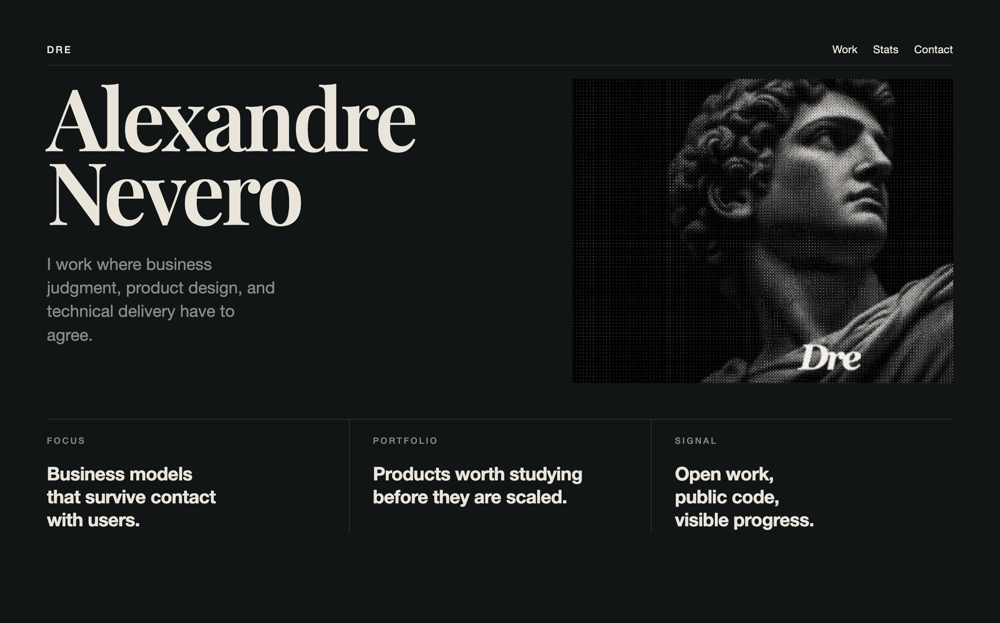

  

[Email](mailto:andreinevero@gmail.com) · [LinkedIn](https://www.linkedin.com/in/alexandre-andrei-nevero/) · [GitHub](https://github.com/Alexandre-Nevero)

## Selected work

### [SelyoPass](https://github.com/Alexandre-Nevero/SelyoPass)

Founder. Testnet prototype for portable Philippine KYB evidence.

### [LINGAP](https://github.com/wolfsenberg/LINGAP)

Backend developer. Collaborative work on transparent aid infrastructure.

### [GuidHer](https://github.com/1-N-2-Dis/GuidHer)

Business research. Product framing and public-interest problem work.

## GitHub activity

This snapshot is scheduled to refresh daily through GitHub Actions.

## Contact

Reach me at [andreinevero@gmail.com](mailto:andreinevero@gmail.com) or on [LinkedIn](https://www.linkedin.com/in/alexandre-andrei-nevero/).
