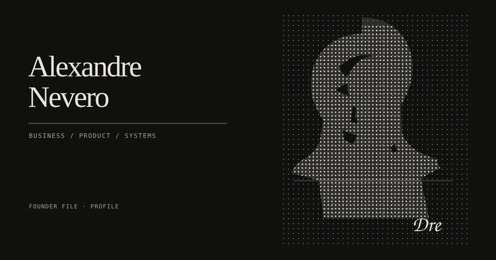
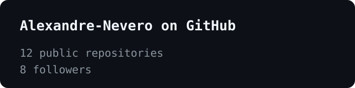

  

# Alexandre Nevero

Business and product architect who builds. I work from commercial framing to usable systems, with enough technical fluency to stay close to the work.

[Email](mailto:andreinevero@gmail.com) · [LinkedIn](https://www.linkedin.com/in/alexandre-andrei-nevero/) · [GitHub](https://github.com/Alexandre-Nevero)

## Focus

Business-first product thinking, technical systems, and work that turns a real operating problem into a clear product path.

## Portfolio

Selected public work across owned builds and collaborative projects.

## Signal

I work across product framing, business research, and backend delivery. The role attached to each project is exact.

## Selected work

### [SelyoPass](https://github.com/Alexandre-Nevero/SelyoPass)

Founder. Testnet prototype for portable Philippine KYB evidence.

### [LINGAP](https://github.com/wolfsenberg/LINGAP)

Backend developer. Collaborative work on transparent aid infrastructure.

### [GuidHer](https://github.com/1-N-2-Dis/GuidHer)

Business research. Product framing and public-interest problem work.

## GitHub activity

This snapshot is scheduled to refresh daily through GitHub Actions.

## Contact

Reach me at [andreinevero@gmail.com](mailto:andreinevero@gmail.com) or on [LinkedIn](https://www.linkedin.com/in/alexandre-andrei-nevero/).
